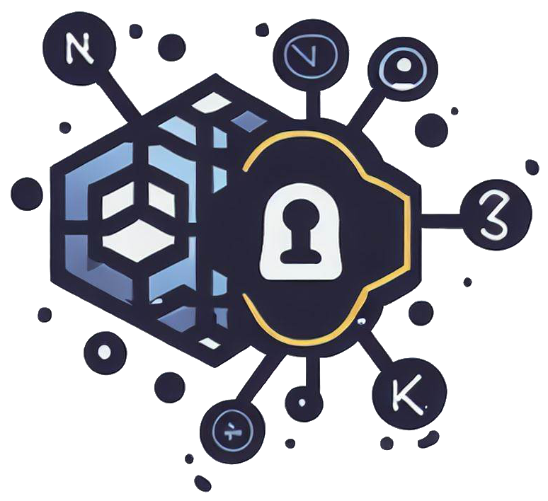

<p align="center">
    
</p>

# Vals-Operator

[](https://github.com/digitalis-io/vals-operator/actions/workflows/pre-commit.yml)
[](https://pkg.go.dev/github.com/digitalis-io/vals-operator?tab=doc)
[](https://goreportcard.com/report/github.com/digitalis-io/vals-operator)


<a href="https://artifacthub.io/packages/helm/vals-operator/vals-operator"></a>

**Vals-Operator** is a Kubernetes operator that integrates external

Here at [Digitalis](https://digitalis.io) we love [vals](https://github.com/helmfile/vals), it's a tool we use daily to keep secrets stored securely. Inspired by it,
we have created an operator to manage Kubernetes secrets. As [Digitalis](https://digitalis.io) and our sister company [AxonOps](https://axonops.com) are data companies,
we also added a set of features tailored for running databases.

*vals-operator* syncs secrets from any secrets store supported by [vals](https://github.com/helmfile/vals) into Kubernetes. Also, *vals-operator* supports database secrets
as provider by the [HashiCorp Vault Secret Engine](https://developer.hashicorp.com/vault/docs/secrets/databases).

## Demo

You can watch this brief video on how it works:

[](https://www.youtube.com/watch?feature=player_embedded&v=wLzkrKdSBT8)

## Mirroring secrets

We have also added the ability to copy secrets between namespaces. It uses the format `ref+k8s://namespace/secret#key`. This way you can keep secrets generated in one namespace in sync with any other namespace in the cluster.

# Installation

You can use the helm chart to install `vals-operator`. First of all, add the repository to your helm installation:

```sh
helm repo add digitalis https://digitalis-io.github.io/helm-charts
```

## Secrets Backend Configuration

vals-operator now supports **both HashiCorp Vault and OpenBao** as secrets backends. The operator automatically detects which backend to use based on the environment variables you provide.

### Using OpenBao (Recommended for New Deployments)

```sh
# Example with OpenBao using Kubernetes auth
helm upgrade --install vals-operator --create-namespace -n vals-operator \
  --set "openbao.enabled=true" \
  --set "openbao.address=http://openbao:8200" \
  --set "openbao.auth.kubernetes.roleId=vals-operator" \
  digitalis/vals-operator

# Example with OpenBao using AppRole auth
helm upgrade --install vals-operator --create-namespace -n vals-operator \
  --set "openbao.enabled=true" \
  --set "openbao.address=http://openbao:8200" \
  --set "openbao.auth.approle.roleId=my-role-id" \
  --set "openbao.auth.approle.secretId=my-secret-id" \
  digitalis/vals-operator
```

### Using HashiCorp Vault (For Existing Deployments)

```sh
# Example with Vault using Kubernetes auth
helm upgrade --install vals-operator --create-namespace -n vals-operator \
  --set "vault.enabled=true" \
  --set "vault.address=http://vault:8200" \
  --set "vault.auth.kubernetes.roleId=vals-operator" \
  digitalis/vals-operator

# Example with Vault using environment variables (legacy method - still supported)
helm upgrade --install vals-operator --create-namespace -n vals-operator \
  --set "env[0].name=VAULT_ROLE_ID,env[0].value=vals-operator" \
  --set "env[1].name=VAULT_ADDR,env[1].value=https://vault:8200" \
  digitalis/vals-operator

# Example for AWS using a secret
kubectl create secret generic -n vals-operator aws-creds \
  --from-literal=AWS_ACCESS_KEY_ID=foo \
  --from-literal=AWS_SECRET_ACCESS_KEY=bar \
  --from-literal=AWS_DEFAULT_REGION=us-west-2

helm upgrade --install vals-operator --create-namespace -n vals-operator \
  --set "secretEnv[0].secretRef.name=aws-creds"  \
  digitalis/vals-operator

# Another example using a Google Cloud service account
kubectl create secret generic -n vals-operator google-creds \
  --from-file=credentials.json=/path/to/service_account.json

helm upgrade --install vals-operator --create-namespace -n vals-operator \
  --set "env[0].name=GOOGLE_APPLICATION_CREDENTIALS,env[0].value=/secret/credentials.json" \
  --set "env[1].name=GCP_PROJECT,env[1].value=my_project" \
  --set "volumes[0].name=creds,volumes[0].secret.secretName=google-creds" \
  --set "volumeMounts[0].name=creds,volumeMounts[0].mountPath=/secret" \
  digitalis/vals-operator
```

> :information_source: Check out the [documentation](./docs/index.md) for further details and examples including EKS integration.

## Dual Backend Support (Vault & OpenBao)

vals-operator now provides **seamless dual backend support**, allowing you to use either HashiCorp Vault or OpenBao without code changes. This enables:

- **Zero-downtime migration** from Vault to OpenBao
- **Backwards compatibility** with existing Vault deployments
- **Environment variable fallback** - OpenBao variables can fall back to Vault variables

### Backend Selection

The operator automatically detects which backend to use:
1. If `BAO_ADDR` is set → Uses OpenBao
2. If `VAULT_ADDR` is set (and `BAO_ADDR` is not) → Uses HashiCorp Vault
3. If both are set → Uses OpenBao with a warning (OpenBao takes precedence)
4. If neither is set → Error

### Environment Variable Compatibility

For backwards compatibility, environment variables automatically fall back:
- `BAO_*` variables fall back to `VAULT_*` if not set
- This allows gradual migration without breaking existing configurations

Example:
```sh
# These configurations are equivalent:
BAO_ADDR=http://openbao:8200
VAULT_ROLE_ID=my-role  # Will be used for OpenBao if BAO_ROLE_ID is not set

# Or explicitly set both:
BAO_ADDR=http://openbao:8200
BAO_ROLE_ID=my-role
```

For detailed migration instructions, see [OPENBAO.md](OPENBAO.md) and [DUAL_BACKEND_SUPPORT.md](DUAL_BACKEND_SUPPORT.md).

## Authentication Configuration

### OpenBao Authentication

For OpenBao, you can use the following environment variables:

* **BAO_ADDR**: URL to the OpenBao server, e.g., http://openbao:8200
* **BAO_ROLE_ID**: Required for Kubernetes authentication
* **BAO_LOGIN_USER** and **BAO_LOGIN_PASSWORD**: For `userpass` authentication (insecure, not recommended)
* **BAO_APP_ROLE** and **BAO_SECRET_ID**: For `approle` authentication

### HashiCorp Vault Authentication

For HashiCorp Vault, you can use the following environment variables:

* **VAULT_ADDR**: URL to the Vault server, e.g., http://vault:8200
* **VAULT_ROLE_ID**: Required for Kubernetes authentication
* **VAULT_LOGIN_USER** and **VAULT_LOGIN_PASSWORD**: For `userpass` authentication (insecure, not recommended)
* **VAULT_APP_ROLE** and **VAULT_SECRET_ID**: For `approle` authentication

For Kubernetes authentication with either backend, refer to the respective documentation:
- [OpenBao Kubernetes Auth](https://openbao.org/docs/auth/kubernetes/)
- [Vault Kubernetes Auth](https://www.vaultproject.io/docs/auth/kubernetes)

# Usage

```yaml
apiVersion: digitalis.io/v1
kind: ValsSecret
metadata:
  name: vals-secret-sample
  labels:
    owner: digitalis.io
spec:
  name: my-secret # Optional, default is the resource name
  ttl: 3600       # Optional, default is 5 minutes. The secret will be checked at every "reconcile period". See below.
  type: Opaque    # Default type, others supported
  data:
    username:
      ref: ref+vault://secret/database/username
      encoding: text
    password:
      ref: ref+vault://secret/database/password
      encoding: text
    ssh:
      ref: ref+vault://secret/database/ssh-private-key
      encoding: base64
    aws-user:
      ref: ref+awssecrets://kube/test#username
    aws-pass:
      ref: ref+awssecrets://kube/test#password
    ns-secret:
      ref: ref+k8s://namespace/secret#key
    plain-text:
      ref: literal_name # this is not processed by any secrets agent but is added to the secret as a literal string
  template:
    config.yaml: |
      # Config generated by Vals-Operator on {{ now | date "2006-01-02" }}
      username: {{.username}}
      password: {{.password}}
      {{- if .url }}
      url: {{ .url | lower }}
      {{ end }}
  rollout: # optional: run a `rollout` to make the pods use new secret
    - kind: Deployment
      name: myapp
```

The example above will create a secret named `my-secret` and get the values from the different sources. The secret will be kept in sync against the backed secrets store.

The `TTL` is optional and used to decrease the number of times the operator calls the backend secrets store as some of them such as [AWS Secrets Manager](https://aws.amazon.com/secrets-manager/pricing/) will incur a cost.

The default encoding is `text` but you can change it to `base64` per secret reference. This way you can, for example, base64 encode large configuration files. If you omit the `ref+` prefix `vals-operator` will not process the string and it will be added to the secret as as literal string.

You may also use GoLang templates to format a secret. You can inject as variables any of the keys referenced in the `data` section to format, for example, a configuration file.
The [sprig](https://github.com/Masterminds/sprig/blob/master/docs/index.md) functions are supported.

## Vault database credentials

---
> **_NOTE:_**  Vault >= 1.10 is required for this feature to work
---

A great feature in HashiCorp Vault is the generate [database credentials](https://developer.hashicorp.com/vault/docs/secrets/databases) dynamically.
The missing part is you need these credentials in Kubernertes where your applications are. This is why we have added a new resource definition to do just that:

```yaml
apiVersion: digitalis.io/v1beta1
kind: DbSecret
metadata:
  name: cassandra
spec:
  renew: true # this is the default, otherwise a new credential will be generated every time
  vault:
    role: readonly
    mount: cass000
  template: # optional: change the secret format
    CASSANDRA_USERNAME: "{{ .username }}"
    CASSANDRA_PASSWORD: "{{ .password }}"
  rollout: # optional: run a `rollout` to make the pods use new credentials
    - kind: Deployment
      name: cassandra-client
    - kind: StatefulSet
      name: cassandra-client-other
```

## Advance config: password rotation

If you're running a database you may want to keep the secrets in sync between your secrets store, Kubernetes and the database. This can be handy for password rotation to ensure the clients don't use the same password all the time. Please be aware your client *must* suppport re-reading the secret and reconnecting whenever it is updated.

_We don't yet support TLS, we'll add it to future releases._

```yaml
---
apiVersion: digitalis.io/v1
kind: ValsSecret
metadata:
  name: vals-secret-sample
  labels:
    owner: digitalis.io
spec:
  name: my-secret # Optional, default is the resource name
  ttl: 10         # Optional, default is 0. The secret will be checked at every "reconcile period". See below.
  type: Opaque    # Default type, others supported
  data:
    username:
      ref: ref+gcpsecrets://databases/test#username
      encoding: text
    password:
      ref: ref+gcpsecrets://databases/test#password
      encoding: text
  databases:
    - driver: cassandra
      loginCredentials:
        secretName: cassandra-creds # secret containing the username and password to access the DB and run the below query
        usernameKey: username       # in the secret, which key contains the username (default `cassandra`)
        passwordKey: password       # in the secret, which key contains the password
      port: 9042
      usernameKey: username
      passwordKey: password
      hosts:                        # list all your cassandra nodes here
        - cassandra01
        - cassandra02
    - driver: postgres
      loginCredentials:
        secretName: postgres-creds
        usernameKey: username
        passwordKey: password
      port: 5432
      usernameKey: username
      passwordKey: password
      hosts:
        - postgres
    - driver: mysql
      loginCredentials:
        secretName: mysql-creds
        namespace: mysql-server
        passwordKey: mysql-root-password # if username is omitted it defaults to `mysql`
      port: 3306
      usernameKey: username
      passwordKey: password
      userHost: "%"                     # default
      hosts:
        - mysql
    - driver: elastic
      loginCredentials:
        secretName: elastic-creds
        namespace: elastic-server
        usernameKey: username           # the username defaults to 'elastic' if not provided
        passwordKey: password
      port: 9200
      usernameKey: username
      passwordKey: password
      hosts:
        - my-elastic                    # this would be converted to http://my-elastic:9200
        - https://my-other-elastic:9200 # provide full URL instead
```
