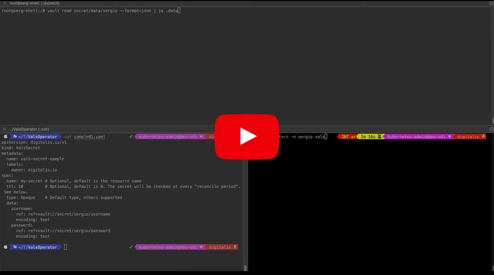

<p align="center">
    
</p>

# Vals-Operator

[](https://github.com/digitalis-io/vals-operator/actions/workflows/pre-commit.yml)
[](https://pkg.go.dev/github.com/digitalis-io/vals-operator?tab=doc)
[](https://goreportcard.com/report/github.com/digitalis-io/vals-operator)


<a href="https://artifacthub.io/packages/helm/vals-operator/vals-operator"></a>

**Vals-Operator** is a Kubernetes operator that integrates external secret stores with Kubernetes, keeping your secrets in sync.

Here at [Digitalis](https://digitalis.io) we love [vals](https://github.com/helmfile/vals), it's a tool we use daily to keep secrets stored securely. Inspired by it,
we have created an operator to manage Kubernetes secrets. As [Digitalis](https://digitalis.io) and our sister company [AxonOps](https://axonops.com) are data companies,
we also added a set of features tailored for running databases.

*vals-operator* syncs secrets from any secrets store supported by [vals](https://github.com/helmfile/vals) into Kubernetes. Also, *vals-operator* supports database secrets
as provider by the [HashiCorp Vault Secret Engine](https://developer.hashicorp.com/vault/docs/secrets/databases).

## Demo

You can watch this brief video on how it works:

[](https://www.youtube.com/watch?feature=player_embedded&v=wLzkrKdSBT8)

## Mirroring secrets

Vals-operator can copy secrets between namespaces using the `ref+k8s://namespace/secret#key` format. This lets a `ValsSecret` in one namespace pull a value from a Kubernetes secret in another namespace and keep it in sync.

> **Warning:** Cross-namespace `ref+k8s://` references allow any namespace with a `ValsSecret` to read secrets from other namespaces, subject only to the operator's RBAC permissions — not the requesting namespace's own permissions. Admins SHOULD restrict this behaviour in multi-tenant clusters using the flags documented in [Operator Flags](#operator-flags).

# Operator Flags

The operator binary accepts the following flags. All flags are optional unless noted.

| Flag | Type | Default | Description |
|------|------|---------|-------------|
| `-metrics-bind-address` | string | `:8080` | Address the metrics endpoint binds to. |
| `-health-probe-bind-address` | string | `:8081` | Address the health probe endpoint binds to. |
| `-reconcile-period` | duration | `5s` | How often the controller re-queues reconciliation events. |
| `-ttl` | duration | `5m0s` | How often each secret is checked against the backend store for updates. |
| `-watch-namespaces` | string | `""` | Comma-separated list of namespaces the operator watches. Empty means all namespaces. |
| `-exclude-namespaces` | string | `""` | Comma-separated list of namespaces the operator ignores entirely. |
| `-record-changes` | bool | `true` | Records each secret update as a Kubernetes Event, visible via `kubectl describe`. Can be overridden per resource with the annotation `vals-operator.digitalis.io/record: "true"`. |
| `-leader-elect` | bool | `false` | Enables leader election, ensuring only one active controller instance when running multiple replicas. |
| `-disable-namespace-sync` | bool | `false` | Blocks all cross-namespace `ref+k8s://` references. See [Cross-Namespace Reference Security](#cross-namespace-reference-security). |
| `-allowed-namespaces-for-sync` | string | `""` | Comma-separated allowlist of namespaces that may be referenced via `ref+k8s://`. See [Cross-Namespace Reference Security](#cross-namespace-reference-security). |

## Cross-Namespace Reference Security

The `ref+k8s://namespace/secret#key` syntax lets a `ValsSecret` read a Kubernetes secret from a different namespace. In multi-tenant clusters this is a privilege escalation vector: a tenant who can create `ValsSecret` resources can read secrets from any namespace the operator has RBAC access to.

Two flags control this behaviour.

### `-disable-namespace-sync`

When set to `true`, the operator rejects any `ref+k8s://` reference where the target namespace differs from the `ValsSecret`'s own namespace. Same-namespace references are never blocked.

A rejected reference produces the event:

```
cross-namespace ref+k8s:// is disabled: namespace "tenant-a" cannot reference "tenant-b"
```

Use this flag in clusters where no cross-namespace secret sharing is required. It is the most restrictive option.

```sh
helm upgrade --install vals-operator digitalis/vals-operator \
  --set "extraArgs[0]=-disable-namespace-sync=true"
```

### `-allowed-namespaces-for-sync`

Provides a namespace-level allowlist for cross-namespace `ref+k8s://` references. Only namespaces named in the list may be used as the target of a cross-namespace reference. Same-namespace references are always permitted regardless of this list.

A reference targeting a namespace not in the allowlist produces the event:

```
cross-namespace ref+k8s:// denied: namespace "restricted" is not in the allowed list
```

When the value is empty (the default), all namespaces are allowed — subject to `-disable-namespace-sync`.

```sh
helm upgrade --install vals-operator digitalis/vals-operator \
  --set "extraArgs[0]=-allowed-namespaces-for-sync=shared-secrets,platform"
```

### Precedence

`-disable-namespace-sync` takes precedence over `-allowed-namespaces-for-sync`. When `-disable-namespace-sync=true`, the allowlist is not consulted — all cross-namespace references are rejected regardless of the allowlist contents.

| `-disable-namespace-sync` | `-allowed-namespaces-for-sync` | Result |
|---------------------------|-------------------------------|--------|
| `false` | `""` (empty) | All cross-namespace refs allowed |
| `false` | `"ns-a,ns-b"` | Only refs targeting `ns-a` or `ns-b` allowed |
| `true` | any value | All cross-namespace refs rejected |

Same-namespace references are always allowed in every configuration.

# Installation

You can use the helm chart to install `vals-operator`. First of all, add the repository to your helm installation:

```sh
helm repo add digitalis https://digitalis-io.github.io/helm-charts
```

### Install via OCI Registry (Helm 3.8+)

The chart is published as an OCI artifact on every release. This is the RECOMMENDED installation method for Helm 3.8 and later — no `helm repo add` step is required.

```bash
helm install vals-operator oci://ghcr.io/digitalis-io/helm-charts/vals-operator --version <version>
```

To upgrade:

```bash
helm upgrade vals-operator oci://ghcr.io/digitalis-io/helm-charts/vals-operator --version <version>
```

> **Note:** The traditional Helm repository at `https://digitalis-io.github.io/helm-charts` remains available during the transition. Consumers on Helm 3.7 or earlier MUST use the `helm repo add` method above.

## Verifying Signatures

Container images and the Helm OCI chart are signed on every release using
[cosign](https://github.com/sigstore/cosign) keyless signing via GitHub Actions
OIDC. No long-lived signing key is used — verification trusts only the Sigstore
public infrastructure and the workflow identity that produced the artifact.

Install cosign with `brew install cosign` or grab a binary from the
[Sigstore releases page](https://github.com/sigstore/cosign/releases).

> **Important:** Always verify by an immutable reference — the version tag
> (`vX.Y.Z`) or, preferably, the image digest (`@sha256:...`). The mutable
> `:latest` tag is not a stable signing target.

Verify the container image (substitute the release tag):

```sh
cosign verify ghcr.io/digitalis-io/vals-operator:<TAG> \
  --certificate-identity-regexp "^https://github\.com/digitalis-io/vals-operator/\.github/workflows/release\.yml@refs/tags/v[0-9]+\.[0-9]+\.[0-9]+$" \
  --certificate-oidc-issuer https://token.actions.githubusercontent.com \
  | jq .
```

Verify the Helm OCI chart (substitute the chart version, no leading `v`):

```sh
cosign verify ghcr.io/digitalis-io/helm-charts/vals-operator:<CHART_VERSION> \
  --certificate-identity-regexp "^https://github\.com/digitalis-io/vals-operator/\.github/workflows/release\.yml@refs/tags/v[0-9]+\.[0-9]+\.[0-9]+$" \
  --certificate-oidc-issuer https://token.actions.githubusercontent.com \
  | jq .
```

## Software Bill of Materials

Every released container image ships with an SPDX 2.3 JSON and a CycloneDX 1.5
JSON SBOM. Both are attached as assets to the corresponding GitHub Release, and
the SPDX SBOM is additionally recorded as a cosign attestation on the image
digest.

Download from the GitHub Release:

```
https://github.com/digitalis-io/vals-operator/releases/download/<TAG>/vals-operator-<TAG>-sbom.spdx.json
https://github.com/digitalis-io/vals-operator/releases/download/<TAG>/vals-operator-<TAG>-sbom.cdx.json
```

Verify the SBOM attestation against the image digest:

```sh
cosign verify-attestation \
  --type spdxjson \
  --certificate-identity-regexp "^https://github\.com/digitalis-io/vals-operator/\.github/workflows/release\.yml@refs/tags/v[0-9]+\.[0-9]+\.[0-9]+$" \
  --certificate-oidc-issuer https://token.actions.githubusercontent.com \
  ghcr.io/digitalis-io/vals-operator@<DIGEST> \
  | jq '.payload | @base64d | fromjson'
```

## Secrets Backend Configuration

vals-operator now supports **both HashiCorp Vault and OpenBao** as secrets backends. The operator automatically detects which backend to use based on the environment variables you provide.

### Using OpenBao (Recommended for New Deployments)

```sh
# Example with OpenBao using Kubernetes auth
helm upgrade --install vals-operator --create-namespace -n vals-operator \
  --set "openbao.enabled=true" \
  --set "openbao.address=http://openbao:8200" \
  --set "openbao.auth.kubernetes.roleId=vals-operator" \
  digitalis/vals-operator

# Example with OpenBao using AppRole auth
helm upgrade --install vals-operator --create-namespace -n vals-operator \
  --set "openbao.enabled=true" \
  --set "openbao.address=http://openbao:8200" \
  --set "openbao.auth.approle.roleId=my-role-id" \
  --set "openbao.auth.approle.secretId=my-secret-id" \
  digitalis/vals-operator
```

### Using HashiCorp Vault (For Existing Deployments)

```sh
# Example with Vault using Kubernetes auth
helm upgrade --install vals-operator --create-namespace -n vals-operator \
  --set "vault.enabled=true" \
  --set "vault.address=http://vault:8200" \
  --set "vault.auth.kubernetes.roleId=vals-operator" \
  digitalis/vals-operator

# Example with Vault using environment variables (legacy method - still supported)
helm upgrade --install vals-operator --create-namespace -n vals-operator \
  --set "env[0].name=VAULT_ROLE_ID,env[0].value=vals-operator" \
  --set "env[1].name=VAULT_ADDR,env[1].value=https://vault:8200" \
  digitalis/vals-operator

# Example for AWS using a secret
kubectl create secret generic -n vals-operator aws-creds \
  --from-literal=AWS_ACCESS_KEY_ID=foo \
  --from-literal=AWS_SECRET_ACCESS_KEY=bar \
  --from-literal=AWS_DEFAULT_REGION=us-west-2

helm upgrade --install vals-operator --create-namespace -n vals-operator \
  --set "secretEnv[0].secretRef.name=aws-creds"  \
  digitalis/vals-operator

# Another example using a Google Cloud service account
kubectl create secret generic -n vals-operator google-creds \
  --from-file=credentials.json=/path/to/service_account.json

helm upgrade --install vals-operator --create-namespace -n vals-operator \
  --set "env[0].name=GOOGLE_APPLICATION_CREDENTIALS,env[0].value=/secret/credentials.json" \
  --set "env[1].name=GCP_PROJECT,env[1].value=my_project" \
  --set "volumes[0].name=creds,volumes[0].secret.secretName=google-creds" \
  --set "volumeMounts[0].name=creds,volumeMounts[0].mountPath=/secret" \
  digitalis/vals-operator
```

> :information_source: Check out the [documentation](./docs/index.md) for further details and examples including EKS integration.

## Dual Backend Support (Vault & OpenBao)

vals-operator now provides **seamless dual backend support**, allowing you to use either HashiCorp Vault or OpenBao without code changes. This enables:

- **Zero-downtime migration** from Vault to OpenBao
- **Backwards compatibility** with existing Vault deployments
- **Environment variable fallback** - OpenBao variables can fall back to Vault variables

### Backend Selection

The operator automatically detects which backend to use:
1. If `BAO_ADDR` is set → Uses OpenBao
2. If `VAULT_ADDR` is set (and `BAO_ADDR` is not) → Uses HashiCorp Vault
3. If both are set → Uses OpenBao with a warning (OpenBao takes precedence)
4. If neither is set → Error

### Environment Variable Compatibility

For backwards compatibility, environment variables automatically fall back:
- `BAO_*` variables fall back to `VAULT_*` if not set
- This allows gradual migration without breaking existing configurations

Example:
```sh
# These configurations are equivalent:
BAO_ADDR=http://openbao:8200
VAULT_ROLE_ID=my-role  # Will be used for OpenBao if BAO_ROLE_ID is not set

# Or explicitly set both:
BAO_ADDR=http://openbao:8200
BAO_ROLE_ID=my-role
```

For detailed migration instructions, see [OPENBAO.md](OPENBAO.md) and [DUAL_BACKEND_SUPPORT.md](DUAL_BACKEND_SUPPORT.md).

## Authentication Configuration

### OpenBao Authentication

For OpenBao, you can use the following environment variables:

* **BAO_ADDR**: URL to the OpenBao server, e.g., http://openbao:8200
* **BAO_ROLE_ID**: Required for Kubernetes authentication
* **BAO_LOGIN_USER** and **BAO_LOGIN_PASSWORD**: For `userpass` authentication (insecure, not recommended)
* **BAO_APP_ROLE** and **BAO_SECRET_ID**: For `approle` authentication

### HashiCorp Vault Authentication

For HashiCorp Vault, you can use the following environment variables:

* **VAULT_ADDR**: URL to the Vault server, e.g., http://vault:8200
* **VAULT_ROLE_ID**: Required for Kubernetes authentication
* **VAULT_LOGIN_USER** and **VAULT_LOGIN_PASSWORD**: For `userpass` authentication (insecure, not recommended)
* **VAULT_APP_ROLE** and **VAULT_SECRET_ID**: For `approle` authentication

For Kubernetes authentication with either backend, refer to the respective documentation:
- [OpenBao Kubernetes Auth](https://openbao.org/docs/auth/kubernetes/)
- [Vault Kubernetes Auth](https://www.vaultproject.io/docs/auth/kubernetes)

# Usage

```yaml
apiVersion: digitalis.io/v1
kind: ValsSecret
metadata:
  name: vals-secret-sample
  labels:
    owner: digitalis.io
spec:
  name: my-secret # Optional, default is the resource name
  ttl: 3600       # Optional, default is 5 minutes. The secret will be checked at every "reconcile period". See below.
  type: Opaque    # Default type, others supported
  data:
    username:
      ref: ref+vault://secret/database/username
      encoding: text
    password:
      ref: ref+vault://secret/database/password
      encoding: text
    ssh:
      ref: ref+vault://secret/database/ssh-private-key
      encoding: base64
    aws-user:
      ref: ref+awssecrets://kube/test#username
    aws-pass:
      ref: ref+awssecrets://kube/test#password
    ns-secret:
      ref: ref+k8s://namespace/secret#key
    plain-text:
      ref: literal_name # this is not processed by any secrets agent but is added to the secret as a literal string
  template:
    config.yaml: |
      # Config generated by Vals-Operator on {{ now | date "2006-01-02" }}
      username: {{.username}}
      password: {{.password}}
      {{- if .url }}
      url: {{ .url | lower }}
      {{ end }}
  rollout: # optional: run a `rollout` to make the pods use new secret
    - kind: Deployment
      name: myapp
```

The example above will create a secret named `my-secret` and get the values from the different sources. The secret will be kept in sync against the backed secrets store.

The `TTL` is optional and used to decrease the number of times the operator calls the backend secrets store as some of them such as [AWS Secrets Manager](https://aws.amazon.com/secrets-manager/pricing/) will incur a cost.

The default encoding is `text` but you can change it to `base64` per secret reference. This way you can, for example, base64 encode large configuration files. If you omit the `ref+` prefix `vals-operator` will not process the string and it will be added to the secret as as literal string.

You may also use GoLang templates to format a secret. You can inject as variables any of the keys referenced in the `data` section to format, for example, a configuration file.
The [sprig](https://github.com/Masterminds/sprig/blob/master/docs/index.md) functions are supported.

## Vault/OpenBao database credentials

---
> **_NOTE:_**  Vault >= 1.10 or OpenBao >= 2.0 is required for this feature to work
---

A great feature in HashiCorp Vault and OpenBao is the ability to generate [database credentials](https://developer.hashicorp.com/vault/docs/secrets/databases) dynamically.
The missing part is you need these credentials in Kubernertes where your applications are. This is why we have added a new resource definition to do just that:

```yaml
apiVersion: digitalis.io/v1beta1
kind: DbSecret
metadata:
  name: cassandra
spec:
  renew: true # this is the default, otherwise a new credential will be generated every time
  vault:
    role: readonly
    mount: cass000
  template: # optional: change the secret format
    CASSANDRA_USERNAME: "{{ .username }}"
    CASSANDRA_PASSWORD: "{{ .password }}"
  rollout: # optional: run a `rollout` to make the pods use new credentials
    - kind: Deployment
      name: cassandra-client
    - kind: StatefulSet
      name: cassandra-client-other
```

## Advance config: password rotation

If you're running a database you may want to keep the secrets in sync between your secrets store, Kubernetes and the database. This can be handy for password rotation to ensure the clients don't use the same password all the time. Please be aware your client *must* suppport re-reading the secret and reconnecting whenever it is updated.

_We don't yet support TLS, we'll add it to future releases._

```yaml
---
apiVersion: digitalis.io/v1
kind: ValsSecret
metadata:
  name: vals-secret-sample
  labels:
    owner: digitalis.io
spec:
  name: my-secret # Optional, default is the resource name
  ttl: 10         # Optional, default is 0. The secret will be checked at every "reconcile period". See below.
  type: Opaque    # Default type, others supported
  data:
    username:
      ref: ref+gcpsecrets://databases/test#username
      encoding: text
    password:
      ref: ref+gcpsecrets://databases/test#password
      encoding: text
  databases:
    - driver: cassandra
      loginCredentials:
        secretName: cassandra-creds # secret containing the username and password to access the DB and run the below query
        usernameKey: username       # in the secret, which key contains the username (default `cassandra`)
        passwordKey: password       # in the secret, which key contains the password
      port: 9042
      usernameKey: username
      passwordKey: password
      hosts:                        # list all your cassandra nodes here
        - cassandra01
        - cassandra02
    - driver: postgres
      loginCredentials:
        secretName: postgres-creds
        usernameKey: username
        passwordKey: password
      port: 5432
      usernameKey: username
      passwordKey: password
      hosts:
        - postgres
    - driver: mysql
      loginCredentials:
        secretName: mysql-creds
        namespace: mysql-server
        passwordKey: mysql-root-password # if username is omitted it defaults to `mysql`
      port: 3306
      usernameKey: username
      passwordKey: password
      userHost: "%"                     # default
      hosts:
        - mysql
    - driver: elastic
      loginCredentials:
        secretName: elastic-creds
        namespace: elastic-server
        usernameKey: username           # the username defaults to 'elastic' if not provided
        passwordKey: password
      port: 9200
      usernameKey: username
      passwordKey: password
      hosts:
        - my-elastic                    # this would be converted to http://my-elastic:9200
        - https://my-other-elastic:9200 # provide full URL instead
```
