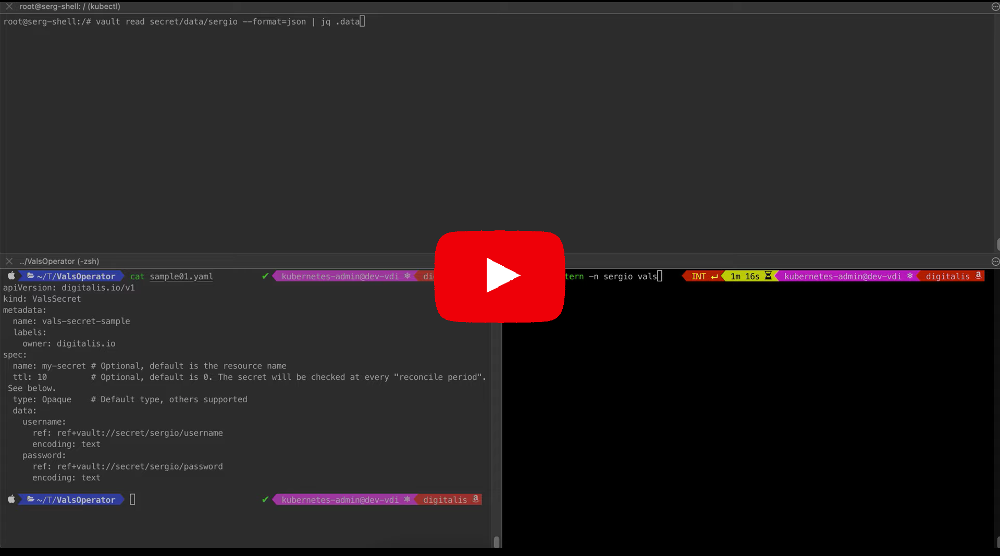

<p align="center">
    
</p>

<p align="center">
  <em>Built and maintained by <a href="https://digitalis.io">Digitalis.IO</a></em>
</p>

# Vals-Operator

[](https://github.com/digitalis-io/vals-operator/actions/workflows/pre-commit.yml)
[](https://pkg.go.dev/github.com/digitalis-io/vals-operator?tab=doc)
[](https://goreportcard.com/report/github.com/digitalis-io/vals-operator)


<a href="https://artifacthub.io/packages/helm/vals-operator/vals-operator"></a>

**Vals-Operator keeps Kubernetes Secrets in sync with your external secrets store.**

Write a `ValsSecret` that points at Vault, OpenBao, AWS Secrets Manager, GCP Secret
Manager or any other store supported by [vals](https://github.com/helmfile/vals), and
the operator creates the Kubernetes Secret and keeps it up to date. It can also issue
dynamic database credentials from the Vault/OpenBao database secrets engine, rotate
database passwords in the database itself, and restart the workloads that consume a
secret when it changes.

Built at [Digitalis](https://digitalis.io), where we run databases for a living — which
is why the database features are here alongside plain secret syncing.

## Contents

- [Quick start](#quick-start)
- [Examples](#examples)
- [Operator flags](#operator-flags)
- [Security](#security)
- [Documentation](#documentation)
- [Contributing](#contributing)

## Demo

[](https://www.youtube.com/watch?feature=player_embedded&v=wLzkrKdSBT8)

## Quick start

Install the operator, pointed at an OpenBao (or Vault) server using Kubernetes auth:

```sh
helm install vals-operator oci://ghcr.io/digitalis-io/helm-charts/vals-operator \
  --create-namespace -n vals-operator \
  --set "openbao.enabled=true" \
  --set "openbao.address=http://openbao.openbao:8200" \
  --set "openbao.auth.kubernetes.roleId=vals-operator"
```

Helm 3.7 or earlier, or any other backend? See [Installation](docs/installation.md)
and [Secrets backends](docs/backends.md).

Create a secret:

```yaml
apiVersion: digitalis.io/v1
kind: ValsSecret
metadata:
  name: database-credentials
spec:
  name: db-creds # Name of the Kubernetes Secret to create
  data:
    username:
      ref: ref+vault://secret/database/username
    password:
      ref: ref+vault://secret/database/password
```

```sh
kubectl apply -f database-credentials.yaml
kubectl get secret db-creds
```

The Secret is re-read from the backend every 5 minutes by default, and every change is
recorded as an Event:

```sh
kubectl describe valssecret database-credentials
```

## Examples

### Render a config file and restart the app

Any key in `data` is available as a template variable, so a whole configuration file
can be assembled from individual secret values. `rollout` restarts the workloads that
consume the Secret when it changes.

```yaml
apiVersion: digitalis.io/v1
kind: ValsSecret
metadata:
  name: app-config
spec:
  name: app-config
  ttl: 3600 # Seconds between backend reads
  data:
    username:
      ref: ref+awssecrets://kube/test#username
    password:
      ref: ref+awssecrets://kube/test#password
    ca-cert:
      ref: ref+vault://secret/app/ca-cert
      encoding: base64 # Decoded before it is stored
    environment:
      ref: production # No ref+ prefix: stored verbatim
  template:
    config.yaml: |
      # Generated by vals-operator on {{ now | date "2006-01-02" }}
      environment: {{ .environment }}
      database:
        username: {{ .username }}
        password: {{ .password }}
  rollout:
    - kind: Deployment
      name: myapp
    - kind: StatefulSet
      name: myapp-workers
```

### Dynamic database credentials

`DbSecret` requests credentials from the Vault/OpenBao
[database secrets engine](https://developer.hashicorp.com/vault/docs/secrets/databases)
and renews the lease before it expires. Requires Vault >= 1.10 or OpenBao >= 2.0.

```yaml
apiVersion: digitalis.io/v1beta1
kind: DbSecret
metadata:
  name: cassandra
spec:
  secretName: cassandra-credentials
  renew: true # Renew the lease rather than issuing new credentials each cycle
  vault:
    mount: cass000  # Database secrets engine mount
    role: readonly  # Role to request credentials for
  template: # Optional: rename the keys the backend returns
    CASSANDRA_USERNAME: "{{ .username }}"
    CASSANDRA_PASSWORD: "{{ .password }}"
  rollout:
    - kind: Deployment
      name: cassandra-client
```

### Inject a secret into a CRD without putting it in Git

With custom targets enabled, `spec.target` writes the value into any resource — here
only one field of a `FlinkDeployment` that ArgoCD otherwise manages.

```yaml
apiVersion: digitalis.io/v1
kind: ValsSecret
metadata:
  name: flink-datadog
spec:
  data:
    datadog_api_key:
      ref: ref+awssecrets://prod/datadog#api_key
  target:
    apiVersion: flink.apache.org/v1beta1
    kind: FlinkDeployment
    name: my-pipeline
    mode: patch
    template: |
      spec:
        flinkConfiguration:
          metrics.reporter.dghttp.apikey: {{ .datadog_api_key | quote }}
```

More, including ConfigMap targets and rotating a database's password in the database
itself, in [Usage](docs/usage.md).

## Operator flags

| Flag | Type | Default | Description |
|------|------|---------|-------------|
| `-metrics-bind-address` | string | `:8080` | Address the metrics endpoint binds to. |
| `-health-probe-bind-address` | string | `:8081` | Address the health probe endpoint binds to. |
| `-reconcile-period` | duration | `5s` | How often the controller re-queues reconciliation events. |
| `-ttl` | duration | `5m0s` | How often each secret is checked against the backend store for updates. |
| `-watch-namespaces` | string | `""` | Comma-separated list of namespaces the operator watches. Empty means all namespaces. |
| `-exclude-namespaces` | string | `""` | Comma-separated list of namespaces the operator ignores entirely. |
| `-record-changes` | bool | `true` | Records each secret update as a Kubernetes Event, visible via `kubectl describe`. Can be overridden per resource with the annotation `vals-operator.digitalis.io/record: "true"`. |
| `-leader-elect` | bool | `false` | Enables leader election, ensuring only one active controller instance when running multiple replicas. |
| `-disable-namespace-sync` | bool | `false` | Blocks all cross-namespace `ref+k8s://` references. See [Security](docs/security.md#cross-namespace-references). |
| `-allowed-namespaces-for-sync` | string | `""` | Comma-separated allowlist of namespaces that may be referenced via `ref+k8s://`. See [Security](docs/security.md#cross-namespace-references). |
| `-allowed-backend-paths` | string | `""` | Restricts which backend paths each namespace may read, covering both `ValsSecret` references (all backends) and `DbSecret` mounts/roles. Semicolon-separated `namespace=prefix[,prefix...]` entries; `*` applies to all namespaces. See [Security](docs/security.md#restricting-backend-paths). |
| `-enable-custom-targets` | bool | `false` | Allow `spec.target` to write into ConfigMaps and CRDs instead of Secrets. Needs `-allowed-target-resources`. See [Security](docs/security.md#custom-targets). |
| `-allowed-target-resources` | string | `""` | Comma-separated `resource.group` list that `spec.target` may write, e.g. `configmaps,flinkdeployments.flink.apache.org`. |

Logging and kubeconfig flags, every Helm value and the supported annotations are in the
[configuration reference](docs/configuration.md).

## Security

The operator authenticates to its backends **once at startup**, with one credential
shared by every namespace. That credential's policy is the real security boundary:
by default, anybody who can create a `ValsSecret` or `DbSecret` in a watched namespace
can read anything the operator can read.

On any cluster where namespaces are not all equally trusted, set `allowedBackendPaths`
and restrict cross-namespace `ref+k8s://` references. The threat model and the full set
of controls are in [Security](docs/security.md).

Releases are signed with [cosign](https://github.com/sigstore/cosign) keyless signing
and ship SPDX and CycloneDX SBOMs — see
[Verifying signatures](docs/installation.md#verifying-signatures).

Report security issues privately to [info@digitalis.io](mailto:info@digitalis.io).

## Documentation

Full documentation is in [docs/](docs/index.md):

- [Installation](docs/installation.md) — Helm, OCI, CRDs, signature and SBOM verification.
- [Secrets backends](docs/backends.md) — Vault, OpenBao, AWS, GCP and everything else vals supports.
- [Usage](docs/usage.md) — `ValsSecret`, `DbSecret`, templates, rollouts, password rotation.
- [Security](docs/security.md) — threat model and multi-tenancy controls.
- [Configuration reference](docs/configuration.md) — every flag, value and annotation.
- [Upgrade notes](docs/upgrading.md) — read before upgrading an existing deployment.
- [EKS integration](docs/eks/index.md) — IRSA setup for reading AWS secrets.

Runnable manifests live in [config/samples/](config/samples).

## Contributing

Bug reports, feature requests and pull requests are welcome. See
[CONTRIBUTING.md](CONTRIBUTING.md) for how to build and test, and
[CHANGELOG.md](CHANGELOG.md) for the release history.

## License

Licensed under the [Apache License 2.0](LICENSE).

---

Maintained by [Digitalis.io](https://digitalis.io). For commercial support,
consulting or managed services, get in touch at
[digitalis.io/contact](https://digitalis.io/contact).
