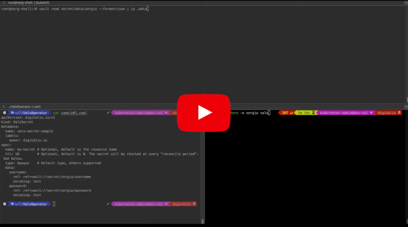

# Vals-Operator

[](https://github.com/digitalis-io/vals-operator/actions/workflows/pre-commit.yml)
[](https://pkg.go.dev/github.com/digitalis-io/vals-operator?tab=doc)


Here at [Digitalis](https://digitalis.io) we love [vals](https://github.com/variantdev/vals), it's a tool we use daily to keep secrets stored securely. We also use [secrets-manager](https://github.com/tuenti/secrets-manager) on the Kubernetes deployment we manage. Inspired by these two wonderful tools we have created this operator.

*vals-operator* syncs secrets from any secrets store supported by [vals](https://github.com/variantdev/vals) into Kubernetes. It works very similarly to [secrets-manager](https://github.com/tuenti/secrets-manager) and the code is actually based on it. Where they differ is that it not just supports HashiCorp Vault but many other secrets stores.

## Demo

You can watch this brief video on how it works:

[](https://www.youtube.com/watch?feature=player_embedded&v=wLzkrKdSBT8)

## Mirroring secrets

We have also added the ability to copy secrets between namespaces. It uses the format `ref+k8s://namespace/secret#key`. This way you can keep secrets generated in one namespace in sync with any other namespace in the cluster.

# Installation

You can use the helm chart to install `vals-operator`. First of all, add the repository to your helm installation:

```sh
helm repo add digitalis https://digitalis-io.github.io/helm-charts
```

You will need to provide the configuration to access the secrets store you decided on via either environment variables pre existing secrets.

```sh
# Example for Vault
helm upgrade --install vals-operator --create-namespace -n vals-operator \
  --set "env[0].name=VAULT_ROLE_ID,env[0].value=vals-operator" \
  --set "env[1].name=VAULT_SECRET_ID,env[1].value=my-secret-id" \
  --set "env[2].name=VAULT_ADDR,env[2].value=https://vault:8200"
  digitalis/vals-operator

# Example for AWS using a secret
kubectl create secret generic -n vals-operator aws-creds \
  --from-literal=AWS_ACCESS_KEY_ID=foo \
  --from-literal=AWS_SECRET_ACCESS_KEY=bar \
  --from-literal=AWS_DEFAULT_REGION=us-west-2

helm upgrade --install vals-operator --create-namespace -n vals-operator \
  --set "secretEnv[0].secretRef.name=aws-creds"  \
  digitalis/vals-operator

# Another example using a Google Cloud service account
kubectl create secret generic -n vals-operator google-creds \
  --from-file=credentials.json=/path/to/service_account.json

helm upgrade --install vals-operator --create-namespace -n vals-operator \
  --set "env[0].name=GOOGLE_APPLICATION_CREDENTIALS,env[0].value=/secret/credentials.json" \
  --set "env[1].name=GCP_PROJECT,env[1].value=my_project" \
  --set "volumes[0].name=creds,volumes[0].secret.secretName=google-creds" \
  --set "volumeMounts[0].name=creds,volumeMounts[0].mountPath=/secret" \
  digitalis/vals-operator
```

## Rancher

`Vals-Operator` is also available to install from the Rancher Marketplace.


## HashiCorp Vault Authentication

If you're using Vault as backend you can also enable the Kubernetes Auth login method. Refer to the [HashiCorp documentation](https://www.vaultproject.io/docs/auth/kubernetes) on creating a role.

You will need to add two additional environment variables to the `vals-operator` installation:

* VAULT_ROLE_ID: name of the Kubernetes Role you created granting access to read the secrets
* VAULT_AUTH_METHOD: set it to `kubernetes`

# Usage

```yaml
apiVersion: digitalis.io/v1
kind: ValsSecret
metadata:
  name: vals-secret-sample
  labels:
    owner: digitalis.io
spec:
  name: my-secret # Optional, default is the resource name
  ttl: 3600       # Optional, default is 0. The secret will be checked at every "reconcile period". See below.
  type: Opaque    # Default type, others supported
  data:
    username:
      ref: ref+vault://secret/database/username
      encoding: text
    password:
      ref: ref+vault://secret/database/password
      encoding: text
    ssh:
      ref: ref+vault://secret/database/ssh-private-key
      encoding: base64
    aws-user:
      ref: ref+awssecrets://kube/test#username
    aws-pass:
      ref: ref+awssecrets://kube/test#password
    ns-secret:
      ref: ref+k8s://namespace/secret#key
```

The example above will create a secret named `my-secret` and get the values from the different sources. The secret will be kept in sync against the backed secrets store.

The `TTL` is optional and used to decrease the number of times the operator calls the backend secrets store as some of them such as [AWS Secrets Manager](https://aws.amazon.com/secrets-manager/pricing/) will incur a cost.

The default encoding is `text` but you can change it to `base64` per secret reference. This way you can, for example, base64 encode large configuration files.

## Advance config: password rotation

If you're running a database you may want to keep the secrets in sync between your secrets store, Kubernetes and the database. This can be handy for password rotation to ensure the clients don't use the same password all the time. Please be aware your client *must* suppport re-reading the secret and reconnecting whenever it is updated.

_We don't yet support TLS, we'll add it to future releases._

```yaml
---
apiVersion: digitalis.io/v1
kind: ValsSecret
metadata:
  name: vals-secret-sample
  labels:
    owner: digitalis.io
spec:
  name: my-secret # Optional, default is the resource name
  ttl: 10         # Optional, default is 0. The secret will be checked at every "reconcile period". See below.
  type: Opaque    # Default type, others supported
  data:
    username:
      ref: ref+gcpsecrets://databases/test#username
      encoding: text
    password:
      ref: ref+gcpsecrets://databases/test#password
      encoding: text
  databases:
    - driver: cassandra
      loginCredentials:
        secretName: cassandra-creds # secret containing the username and password to access the DB and run the below query
        usernameKey: username       # in the secret, which key contains the username (default `cassandra`)
        passwordKey: password       # in the secret, which key contains the password
      port: 9042
      usernameKey: username
      passwordKey: password
      hosts:                        # list all your cassandra nodes here
        - cassandra01
        - cassandra02
    - driver: postgres
      loginCredentials:
        secretName: postgres-creds
        usernameKey: username
        passwordKey: password
      port: 5432
      usernameKey: username
      passwordKey: password
      hosts:
        - postgres
    - driver: mysql
      loginCredentials:
        secretName: mysql-creds
        namespace: mysql-server
        passwordKey: mysql-root-password # if username is omitted it defaults to `mysql`
      port: 3306
      usernameKey: username
      passwordKey: password
      userHost: "%"                     # default
      hosts:
        - mysql
```

## Options

The following options are available. See the [helm chart documentation](charts/vals-operator/README.md) for more information on adding them to your deployment configuration.

```sh
Usage of ./bin/vals-operator:
  -exclude-namespaces string
    	Comma separated list of namespaces to ignore.
  -health-probe-bind-address string
    	The address the probe endpoint binds to. (default ":8081")
  -kubeconfig string
    	Paths to a kubeconfig. Only required if out-of-cluster.
  -leader-elect
    	Enable leader election for controller manager. Enabling this will ensure there is only one active controller manager.
  -metrics-bind-address string
    	The address the metric endpoint binds to. (default ":8080")
  -reconcile-period duration
    	How often the controller will re-queue vals-operator events. (default 5s)
  -record-changes
    	Records every time a secret has been updated. You can view them with kubectl describe. It may also be disabled globally and enabled per secret via the annotation 'vals-operator.digitalis.io/record: "true"' (default true)
  -ttl duration
    	How often to check backend for updates. (default 5m0s)
  -watch-namespaces string
    	Comma separated list of namespaces that vals-operator will watch.
  -zap-devel
    	Development Mode defaults(encoder=consoleEncoder,logLevel=Debug,stackTraceLevel=Warn). Production Mode defaults(encoder=jsonEncoder,logLevel=Info,stackTraceLevel=Error) (default true)
  -zap-encoder value
    	Zap log encoding (one of 'json' or 'console')
  -zap-log-level value
    	Zap Level to configure the verbosity of logging. Can be one of 'debug', 'info', 'error', or any integer value > 0 which corresponds to custom debug levels of increasing verbosity
  -zap-stacktrace-level value
    	Zap Level at and above which stacktraces are captured (one of 'info', 'error', 'panic').
```
