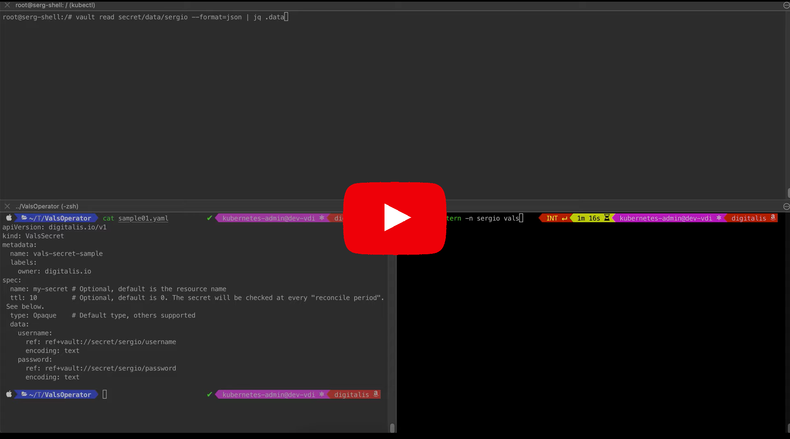

vals-operator
=============

This helm chart installs the Digitalis Vals Operator to manage and sync secrets from supported backends into Kubernetes.

## About Vals-Operator

Here at [Digitalis](https://digitalis.io) we love [vals](https://github.com/helmfile/vals), it's a tool we use daily to keep secrets stored securely. Inspired by this tool,
we have created an operator to manage Kubernetes secrets.

*vals-operator* syncs secrets from any secrets store supported by [vals](https://github.com/helmfile/vals) into Kubernetes. Also, `vals-operator` supports database secrets
as provider by [HashiCorp Vault Secret Engine](https://developer.hashicorp.com/vault/docs/secrets/databases).

## Demo

You can watch this brief video on how it works:

## Chart Values

| Key | Type | Default | Description |
|-----|------|---------|-------------|
| affinity | object | `{}` |  |
| args | list | `[]` |  |
| enableDbSecrets | bool | `true` |  |
| env | list | `[]` |  |
| environmentSecret | string | `""` |  |
| fullnameOverride | string | `""` |  |
| image.pullPolicy | string | `"IfNotPresent"` |  |
| image.repository | string | `"ghcr.io/digitalis-io/vals-operator"` |  |
| image.tag | string | `""` |  |
| imagePullSecrets | list | `[]` |  |
| manageCrds | bool | `true` |  |
| metricsPort | int | `8080` |  |
| nameOverride | string | `""` |  |
| nodeSelector | object | `{}` |  |
| podSecurityContext | object | `{}` |  |
| replicaCount | int | `1` |  |
| resources | object | `{}` |  |
| secretEnv | list | `[]` |  |
| securityContext | object | `{}` |  |
| serviceAccount.annotations | object | `{}` |  |
| serviceAccount.create | bool | `true` |  |
| serviceAccount.name | string | `""` |  |
| serviceMonitor.enabled | bool | `false` |  |
| serviceMonitor.labels | object | `{}` |  |
| tolerations | list | `[]` |  |
| volumeMounts | list | `[]` |  |
| volumes | list | `[]` |  |
